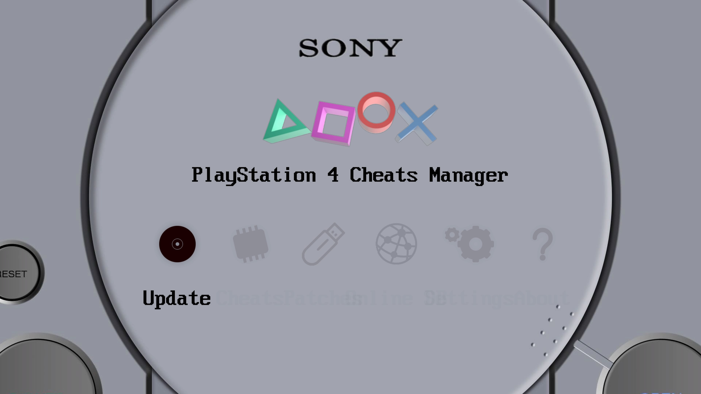
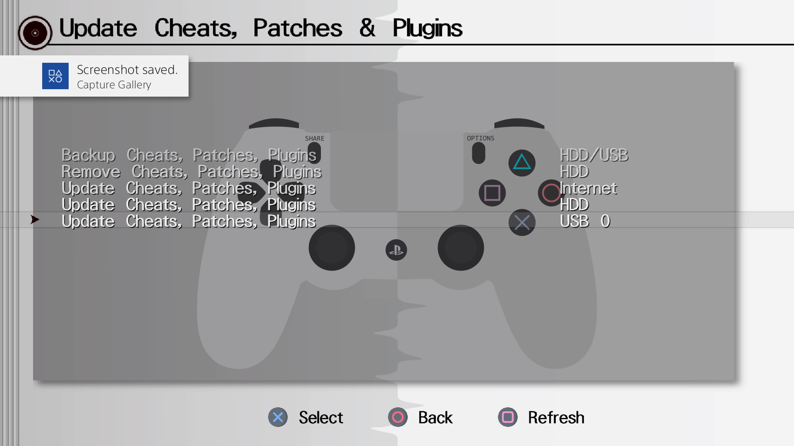
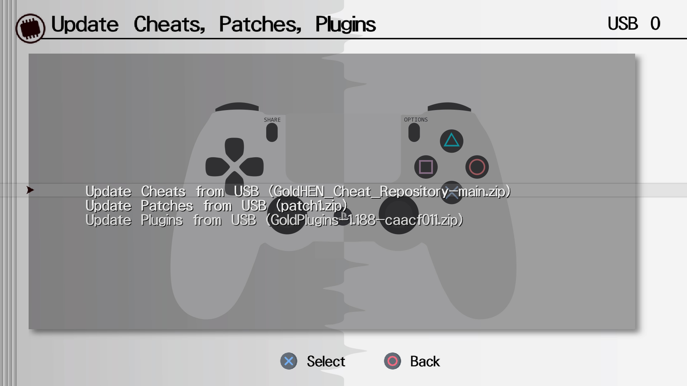
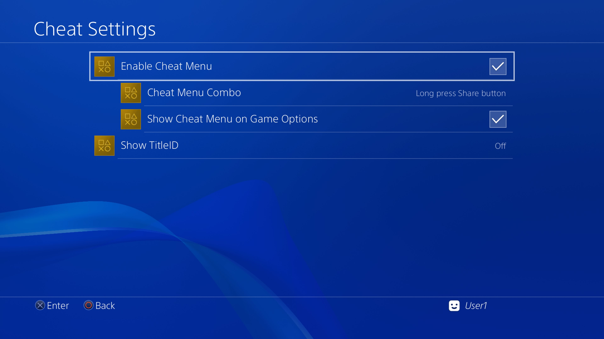
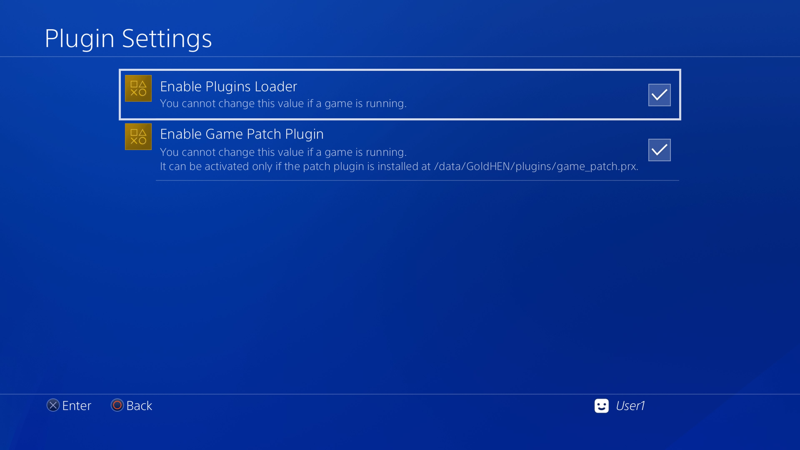
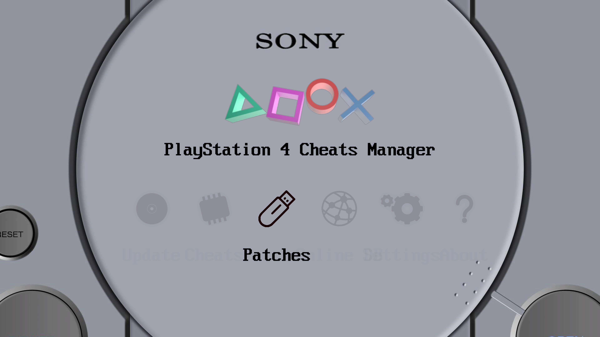
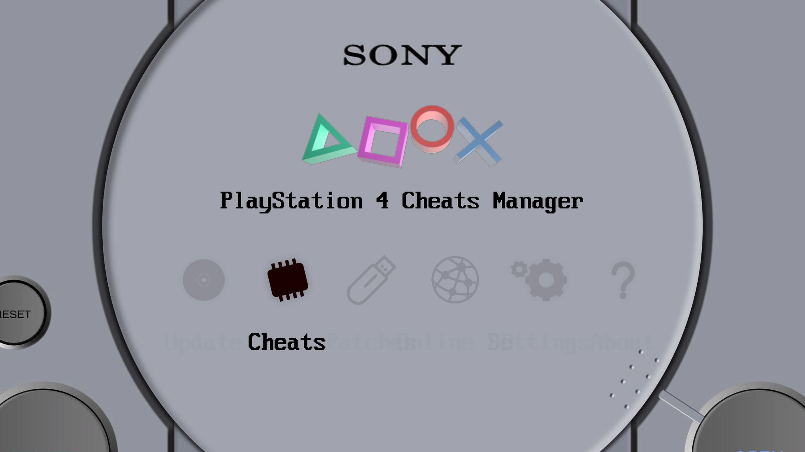

# How-To-Use-Cheats-and-Patches-On-PS4
#NOTICE    
The Cheat Menu is experimental, use with caution.   
Make Backups of your save files with Apollo Save Tool> [Apollo Save Tool](https://pkg-zone.com/details/APOL00004)   

# How to install the Cheats, Patches and Plugins   
1. Download the Cheats Zip from this link > [Cheats](https://github.com/GoldHEN/GoldHEN_Cheat_Repository/archive/refs/heads/main.zip)        
2. Download the Pathes Zip from this link > [Patches](https://github.com/GoldHEN/GoldHEN_Patch_Repository/raw/gh-pages/patch1.zip)  
3. Download the Plugins Zip from this link > [Plugins](https://github.com/GoldHEN/GoldHEN_Plugins_Repository/releases/download/1.188/GoldPlugins-1.188-caacf011.zip)           
3. Take a USB Drive and format it to EXFAT        
4. Put the 3, Zip files on the USB Drive     
5. Download and install the PS4 Cheats Manager Homebrew pkg from PKG Zone >[PS4 Cheats Manager](https://pkg-zone.com/details/CHTM00777)   
6. Put the PS4_CHTM00777 pkg on the USB Drive    
7. Plug the USB Drive into your PS4 and Jailbreak via your preferred method or via one of the guides below   
# [How to use a GUI tool to run PPPwn on Windows](https://github.com/DrYenyen/PPPwnGo-Guide)    
# [How to set up Raspberry-Pi on Windows for PPPwn](https://github.com/DrYenyen/PPPwn-Setup-Guide-For-Raspberry-Pi)                  
8. Install the  PS4_CHTM00777 pkg (PS4 Cheats Manager)  if you dont know how a guide below covers USB FPKG installation    
# [How to install FPKGS](https://github.com/DrYenyen/How-To-Install-PS4-FPKGS)       
9. Run PS4 Cheats Manager from the home screen   
10. On running PS4 Cheats Manager it usually sniffs out the 3, zip files and pulls data from them to make sure everything is where it should be you can do the following   
When you load up into the app go into the Update option
        
Once inside scroll down with the D-Pad to USB 0, at the bottom and select it
     
Select each zip and wait while it loads data from it    
         
Then Press Circle to go Back until you are asked if you want to **Exit to XMB?** then choose Yes   
11. Back in the home screen  from the top left choose the Goldhen Icon   
12. Once inside go  into **Cheat Settings** and match up all the settings as shown below   
    
Then back out and go into **Plugin Settings** and match up all the settings as shown below   
   
**Notice** if you cannot tick **Enable Game Patch Plugin** then you have not setup the PS4 Cheats Manager app correctly or it failed to locate the 3, Zip files follow from Step 10, to refresh the databases manually       
13. **How to use Cheats in game**      
Once you Launch a game you can Long Press the PS button and the cheat menu will show up   
Some games have multiple pages of cheats and you can scroll through them using R1 and L1    
Some cheats require MC or Master Code to be enabled    
14. **How to use Patches**      
Go into the PS4 Cheats Manager    
And Select **Patches**    
    
**Once inside press Triangle to filter and find all the Patches compatible with your currently installed games**    
    
	
**The same can be done inside the Cheats menu to view what cheats are available for your games**      
    
     
# Other guides    	    
# 1. [Guides Thread](https://github.com/DrYenyen/Guide-Links-For-PS4)                
# 2. [How to manually update PS4 firmware](https://github.com/DrYenyen/PS4-Firware-Update-Guide)                     
# 3. [How to install FPKGS](https://github.com/DrYenyen/How-To-Install-PS4-FPKGS)                  
# 4. [How to set up PPPwn on a OpenWRT compatible router(by FalsePhilosopher)](https://github.com/FalsePhilosopher/PPPwnWRT)           
# 5. [How to set up Raspberry-Pi on Windows for PPPwn](https://github.com/DrYenyen/PPPwn-Setup-Guide-For-Raspberry-Pi)         
      	   